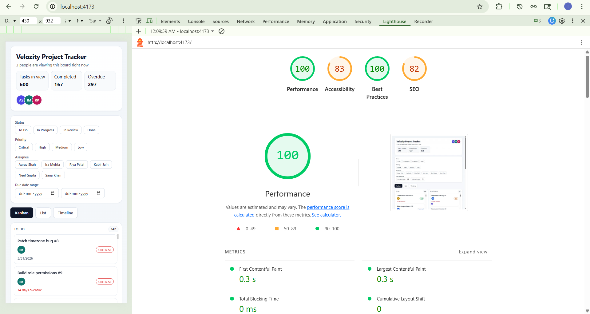

# Multi-View Project Tracker

https://multiview-project-tracker-alpha.vercel.app/

Multi-view project tracker UI built with React + TypeScript, featuring:
- Shared task state across Kanban, List, and Timeline views
- Custom pointer-event drag-and-drop (no DnD library)
- Custom virtual scrolling in List view (500+ tasks)
- URL-synced filters with browser back/forward restoration
- Simulated live collaboration presence indicators

## Tech Stack
- React 19 + TypeScript + Vite
- Zustand for state management
- Tailwind CSS for custom styling

## Setup
1. Install dependencies:
   ```bash
   npm install
   ```
2. Start dev server:
   ```bash
   npm run dev
   ```
3. Build production bundle:
   ```bash
   npm run build
   ```

## State Management Decision (Why Zustand)
I used Zustand because this UI has several cross-cutting states that must remain synchronized across three different views: tasks, filters, list sorting, active view, status updates, and simulated collaboration presence. Zustand keeps this logic centralized while remaining lightweight and ergonomic compared to boilerplate-heavy reducer wiring. It also avoids unnecessary context nesting and lets each component subscribe to only the slices it needs, helping keep re-renders controlled in larger lists.

## Virtual Scrolling Implementation
- Implemented manually in `ListView`.
- Uses fixed row height (`58px`) and a fixed viewport (`540px`) to calculate visible range.
- Renders only visible rows plus a buffer of 5 rows above and below.
- Preserves native scroll behavior by using:
  - A full-height spacer (`tasks.length * rowHeight`)
  - A translated inner window (`translateY(start * rowHeight)`)
- This keeps row count, scroll position, and UX stable at 500+ tasks.

## Drag-and-Drop Implementation
- Implemented in `KanbanView` using pointer events (`pointerdown`, document-level `pointermove`, `pointerup`) for mouse + touch support.
- While dragging:
  - The original card slot is replaced with a placeholder matching card height.
  - A fixed-position drag ghost follows the cursor with opacity + shadow.
  - Drop columns are detected via `elementsFromPoint(...)` and highlighted.
- On drop:
  - Valid column updates task status immediately.
  - Invalid area triggers snap-back animation

## Lighthouse



